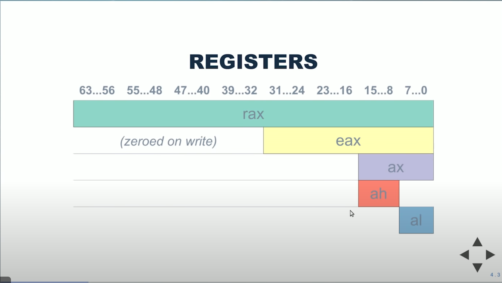

Playing with godbolt compiler explorer: https://godbolt.org

---

X86 Assembly 101:
- Has 64 bit registers:
  - rax, rbx, rcx, rdx, rsp, rbp, rsi, rdi, r8-r15
  - xmm0-xmm15
  - rdi, rsi, rdx... arguments
  - rax is return value
---
r's are 64 bit, e's are 32 bit, ax bottom 16 bits, ah/al 8 bits each


---

Instructions:
```
op
op dest
op dest, src
op dest, src1, src2
```
- op is for example `call`, `ret`, `add`, `sub`, `cmp`...
- `dest`, `src` is register OR memory reference
